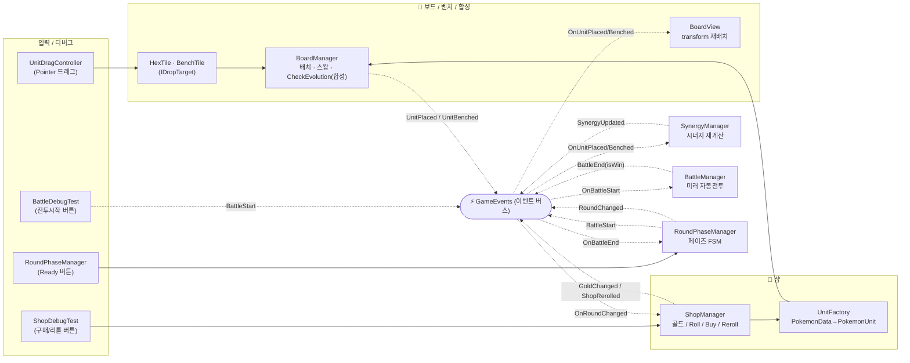
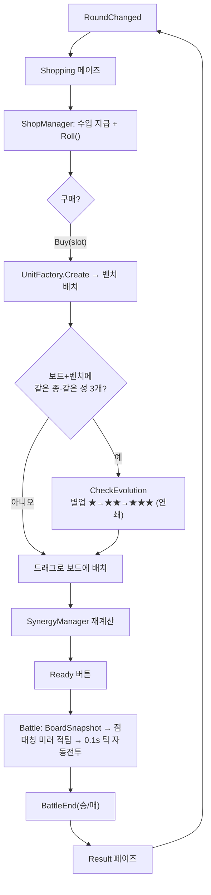

# 구조도 — 샵 · 전투 · 합성 (2026-06-15 기준)

지금 동작하는 세 시스템(샵 / 전투 / 합성)과 그 연결을 정리한 구조도.
핵심 원칙: **모든 매니저는 `GameEvents`(이벤트 버스)로만 통신**하고 서로 직접 참조하지 않는다.

## 1. 컴포넌트 ↔ 이벤트 흐름

## 2. 한 라운드의 시간 흐름 (루프)

## 3. 이벤트 발행/구독 표

| 이벤트 | 발행(쏨) | 구독(받음) → 하는 일 |
|---|---|---|
| `RoundChanged` | RoundPhaseManager(/Network) | **ShopManager**(수입+Roll), RoundPhaseManager(Shopping 진입) |
| `GoldChanged` / `ShopRerolled` | ShopManager | UI 표시 — 현재는 ShopDebugTest가 직접 읽음 |
| `UnitPlaced` / `UnitBenched` | BoardManager | **SynergyManager**(재계산), **BoardView**(위치 반영) |
| `SynergyUpdated` | SynergyManager | UI / (BattleManager는 전투시작 시 pull) |
| `AllPlayersReady` | Network(Ready) | RoundPhaseManager(Battle 진입) |
| `BattleStart` | RoundPhaseManager | **BattleManager**(시뮬 시작) |
| `BattleEnd(isWin)` | BattleManager | RoundPhaseManager(Result→다음 라운드) |

## 4. 한눈 요약
- **샵**: `RoundChanged`로 깨어나 골드 주고 샵 굴림 → `Buy`가 `UnitFactory`로 유닛 만들어 **벤치**에 넣음.
- **합성(일반 진화, GDD 4.2)**: 배치/벤치가 끝날 때마다 `BoardManager.CheckEvolution`이 **같은 종 3개**를 찾아
  **별업**(연쇄 가능). 별도 매니저가 아니라 배치의 부산물로 BoardManager 안에서 처리.
- **전투**: `Ready` → `BattleStart` → `BattleManager`가 보드 스냅샷을 **거울 복제**해 자동전투 → `BattleEnd` → 결과 → 다음 라운드로 **루프**.
- 세 시스템 모두 서로를 직접 모른다. `GameEvents`만 보고 반응 → 하나를 고쳐도 나머지에 영향 없음.

## 관련 문서
- 구현 플랜: `Docs/PLAN_2026-06-15_shop-bench-board-merge.md`
- 시너지 전투 버프(보류): `Docs/PLAN_2026-06-15_synergy-battle-buffs.md`
- 전투: `Docs/PLAN_2026-06-12_battle-manager.md`
